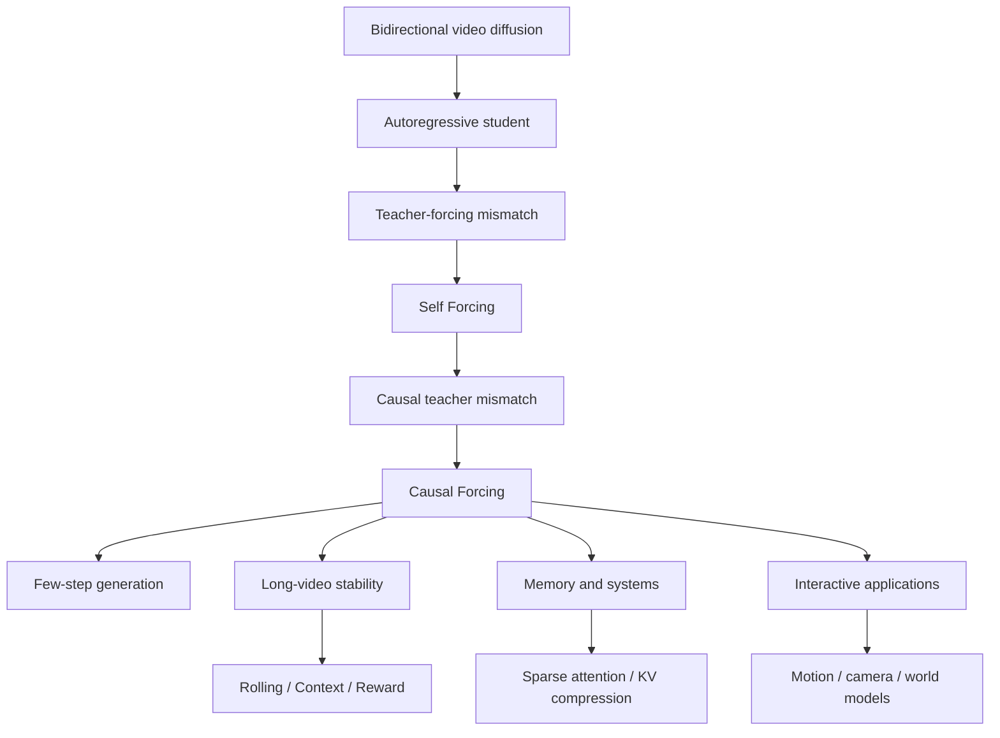

# Idea Map

```mermaid
graph TD
    A[Bidirectional video diffusion] --> B[Autoregressive student]
    B --> C[Teacher-forcing mismatch]
    C --> D[Self Forcing]
    D --> E[Causal teacher mismatch]
    E --> F[Causal Forcing]
    F --> G[Few-step generation]
    F --> H[Long-video stability]
    F --> I[Memory and systems]
    F --> J[Interactive applications]
    H --> K[Rolling / Context / Reward]
    I --> L[Sparse attention / KV compression]
    J --> M[Motion / camera / world models]
```
