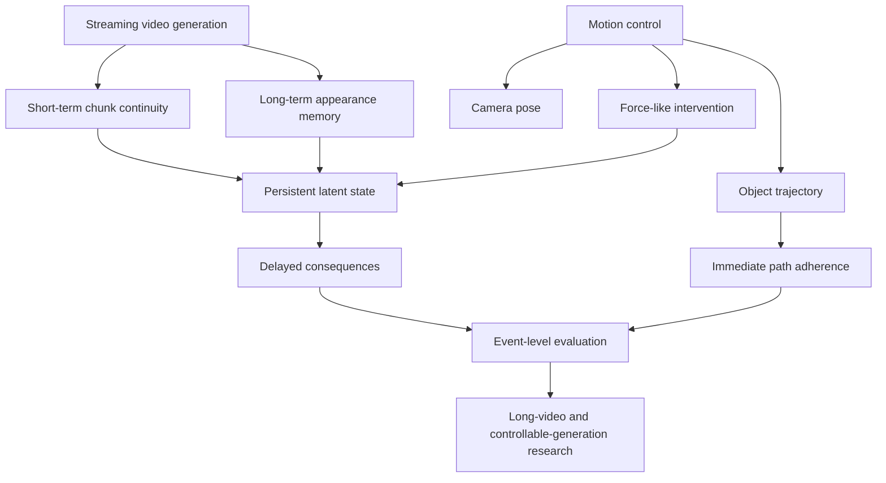

# Idea Map

```mermaid
graph TD
    A[Streaming video generation] --> B[Short-term chunk continuity]
    A --> C[Long-term appearance memory]
    D[Motion control] --> E[Camera pose]
    D --> F[Object trajectory]
    D --> G[Force-like intervention]
    B --> H[Persistent latent state]
    C --> H
    G --> H
    H --> I[Delayed consequences]
    I --> J[Event-level evaluation]
    F --> K[Immediate path adherence]
    K --> J
    J --> L[Long-video and controllable-generation research]
```

The key distinction is between immediate path adherence and persistent state change.
