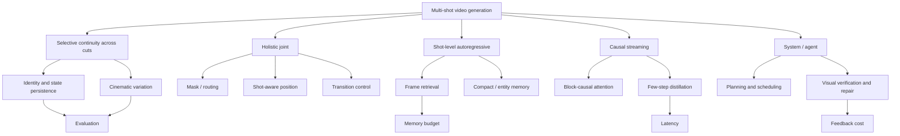

# Idea Map

```mermaid
graph TD
    A[Multi-shot video generation] --> B[Selective continuity across cuts]
    A --> C[Holistic joint]
    A --> D[Shot-level autoregressive]
    A --> E[Causal streaming]
    A --> F[System / agent]
    C --> G[Mask / routing]
    C --> H[Shot-aware position]
    C --> I[Transition control]
    D --> J[Frame retrieval]
    D --> K[Compact / entity memory]
    E --> L[Block-causal attention]
    E --> M[Few-step distillation]
    F --> N[Planning and scheduling]
    F --> O[Visual verification and repair]
    B --> P[Identity and state persistence]
    B --> Q[Cinematic variation]
    J --> R[Memory budget]
    M --> S[Latency]
    O --> T[Feedback cost]
    P --> U[Evaluation]
    Q --> U
```
