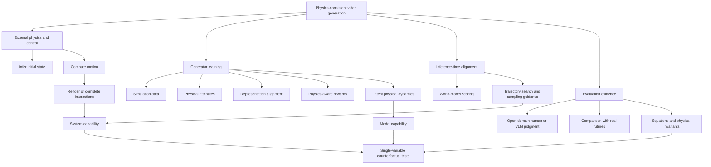

# Idea Map

```mermaid
graph TD
    A[Physics-consistent video generation] --> B[External physics and control]
    A --> C[Generator learning]
    A --> D[Inference-time alignment]
    A --> E[Evaluation evidence]
    B --> B1[Infer initial state]
    B --> B2[Compute motion]
    B2 --> B3[Render or complete interactions]
    C --> C1[Simulation data]
    C --> C2[Physical attributes]
    C --> C3[Representation alignment]
    C --> C4[Physics-aware rewards]
    C --> C5[Latent physical dynamics]
    D --> D1[World-model scoring]
    D --> D2[Trajectory search and sampling guidance]
    E --> E1[Open-domain human or VLM judgment]
    E --> E2[Comparison with real futures]
    E --> E3[Equations and physical invariants]
    B3 --> F[System capability]
    C5 --> G[Model capability]
    D2 --> F
    F --> H[Single-variable counterfactual tests]
    G --> H
    E3 --> H
```
