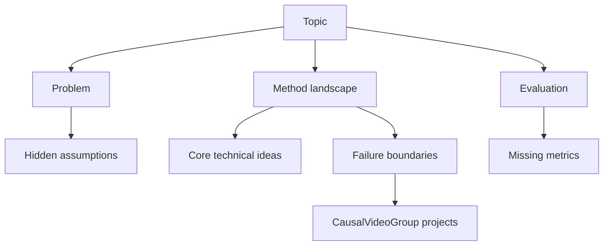

# Idea Map

```mermaid
graph TD
    A[Topic] --> B[Problem]
    A --> C[Method landscape]
    A --> D[Evaluation]
    B --> E[Hidden assumptions]
    C --> F[Core technical ideas]
    C --> G[Failure boundaries]
    D --> H[Missing metrics]
    G --> I[CausalVideoGroup projects]
```

Replace the nodes and edges with a topic-specific taxonomy, timeline, or concept map.
